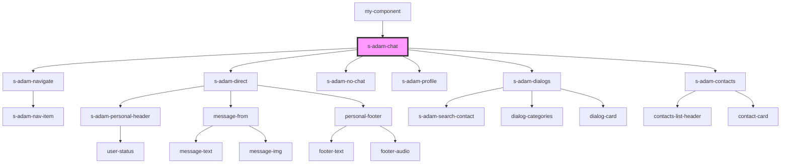

# s-adam-chat

<!-- Auto Generated Below -->

## Properties

| Property                         | Attribute                            | Description                 | Type      | Default     |
| -------------------------------- | ------------------------------------ | --------------------------- | --------- | ----------- |
| `disableInnerSearchContactState` | `disable-inner-search-contact-state` | отключение поиска контактов | `boolean` | `undefined` |

## Dependencies

### Used by

 - [my-component](../../my-component)

### Depends on

- [s-adam-navigate](../s-adam-navigate)
- [s-adam-direct](../s-adam-direct)
- [s-adam-no-chat](../s-adam-no-chat)
- [s-adam-profile](../../shared/s-adam-profile)
- [s-adam-dialogs](../s-adam-dialogs)
- [s-adam-contacts](../s-adam-contacts)

### Graph

----------------------------------------------

*Built with [StencilJS](https://stenciljs.com/)*
