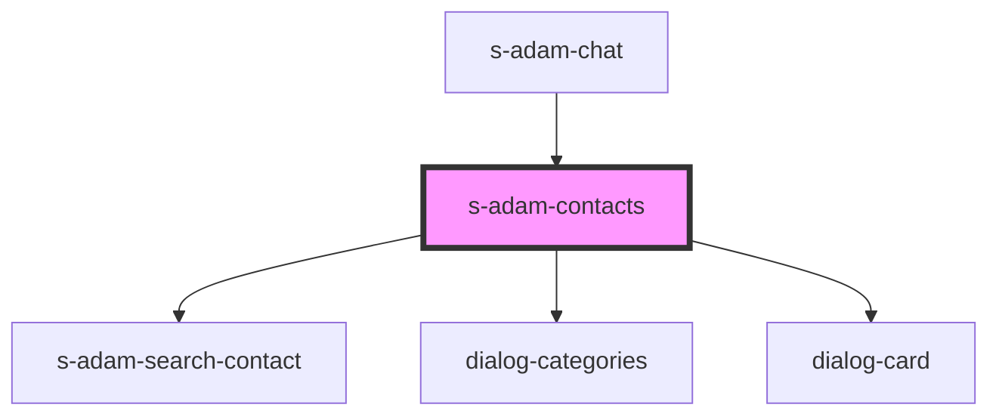

# s-adam-contacts

<!-- Auto Generated Below -->

## Properties

| Property     | Attribute    | Description                 | Type                    | Default     |
| ------------ | ------------ | --------------------------- | ----------------------- | ----------- |
| `categories` | `categories` | массив категорий диалогов   | `any`                   | `undefined` |
| `dialogs`    | --           | Массив с элементами диалога | `ChatDialogInterface[]` | `[]`        |

## Events

| Event             | Description                                            | Type               |
| ----------------- | ------------------------------------------------------ | ------------------ |
| `clickToCategory` | clock on Category                                      | `CustomEvent<any>` |
| `clickToLink`     | Событие для переключения пустой страницы на личный чат | `CustomEvent<any>` |
| `searchContact`   | search contact                                         | `CustomEvent<any>` |

## Dependencies

### Used by

 - [s-adam-chat](../s-adam-chat)

### Depends on

- [s-adam-search-contact](../s-adam-search-contact)
- [dialog-categories](../../shared/dialog-categories)
- [dialog-card](../../shared/dialog-card)

### Graph

----------------------------------------------

*Built with [StencilJS](https://stenciljs.com/)*
