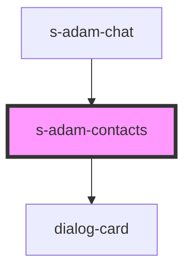

# s-adam-contacts

<!-- Auto Generated Below -->

## Properties

| Property  | Attribute | Description                 | Type        | Default |
| --------- | --------- | --------------------------- | ----------- | ------- |
| `dialogs` | --        | Массив с элементами диалога | `dialogs[]` | `[]`    |

## Events

| Event         | Description                                            | Type               |
| ------------- | ------------------------------------------------------ | ------------------ |
| `clickToLink` | Событие для переключения пустой страницы на личный чат | `CustomEvent<any>` |

## Dependencies

### Used by

 - [s-adam-chat](../s-adam-chat)

### Depends on

- [dialog-card](../../shared/dialog-card)

### Graph

----------------------------------------------

*Built with [StencilJS](https://stenciljs.com/)*
