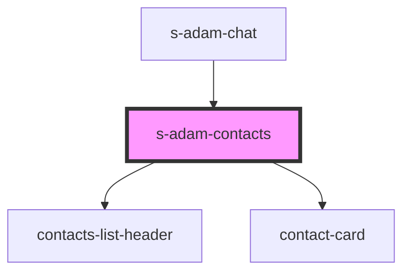

# s-adam-contacts

<!-- Auto Generated Below -->

## Properties

| Property                         | Attribute                            | Description                         | Type                             | Default     |
| -------------------------------- | ------------------------------------ | ----------------------------------- | -------------------------------- | ----------- |
| `contacts`                       | --                                   |                                     | `ChatContactInterface[]`         | `undefined` |
| `disableInnerSearchContactState` | `disable-inner-search-contact-state` | отключение поиска контактов         | `boolean`                        | `undefined` |
| `theme`                          | `theme`                              | Тема для модульного/мобильного чата | `"comp" \| "mobile" \| "module"` | `"mobile"`  |

## Dependencies

### Used by

 - [s-adam-chat](../s-adam-chat)

### Depends on

- [contacts-list-header](../../shared/contacts-list/res/view/contacts-list-header)
- [contact-card](../../shared/contacts-list/res/view/contact-card)

### Graph

----------------------------------------------

*Built with [StencilJS](https://stenciljs.com/)*
