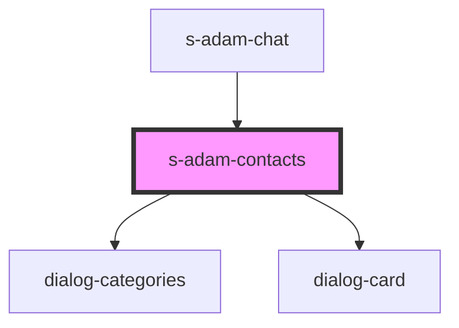

# s-adam-contacts

<!-- Auto Generated Below -->

## Properties

| Property     | Attribute    | Description                 | Type        | Default     |
| ------------ | ------------ | --------------------------- | ----------- | ----------- |
| `categories` | `categories` | массив категорий диалогов   | `any`       | `undefined` |
| `dialogs`    | --           | Массив с элементами диалога | `dialogs[]` | `[]`        |

## Events

| Event           | Description                                            | Type               |
| --------------- | ------------------------------------------------------ | ------------------ |
| `clickToLink`   | Событие для переключения пустой страницы на личный чат | `CustomEvent<any>` |
| `searchContact` | search contact                                         | `CustomEvent<any>` |

## Dependencies

### Used by

 - [s-adam-chat](../s-adam-chat)

### Depends on

- [dialog-categories](../../shared/dialog-categories)
- [dialog-card](../../shared/dialog-card)

### Graph

----------------------------------------------

*Built with [StencilJS](https://stenciljs.com/)*
