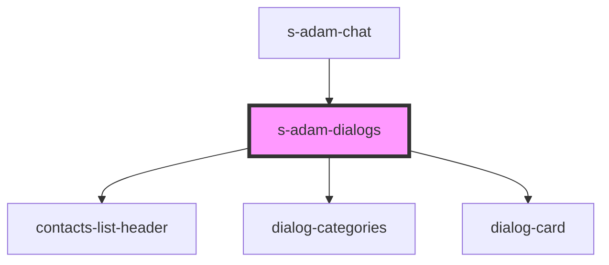

# s-adam-contacts

<!-- Auto Generated Below -->

## Properties

| Property     | Attribute | Description                         | Type                             | Default    |
| ------------ | --------- | ----------------------------------- | -------------------------------- | ---------- |
| `categories` | --        | массив категорий диалогов           | `ChatCategoryInterface[]`        | `[]`       |
| `dialogs`    | --        | Массив с элементами диалога         | `ChatDialogInterface[]`          | `[]`       |
| `theme`      | `theme`   | Тема для модульного/мобильного чата | `"comp" \| "mobile" \| "module"` | `"mobile"` |

## Events

| Event             | Description              | Type                                 |
| ----------------- | ------------------------ | ------------------------------------ |
| `clickToCategory` | clock on Category        | `CustomEvent<ChatCategoryInterface>` |
| `clickToDialog`   | Cобытие клика по диалогу | `CustomEvent<void>`                  |
| `searchDialogs`   | Поиск по контактам       | `CustomEvent<string>`                |

## Dependencies

### Used by

 - [s-adam-chat](../s-adam-chat)

### Depends on

- [contacts-list-header](../../shared/contacts-list/res/view/contacts-list-header)
- [dialog-categories](../../shared/dialog-categories)
- [dialog-card](../../shared/dialog-card)

### Graph

----------------------------------------------

*Built with [StencilJS](https://stenciljs.com/)*
