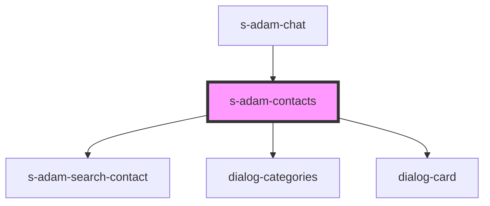

# s-adam-contacts

<!-- Auto Generated Below -->

## Properties

| Property     | Attribute | Description                 | Type                      | Default |
| ------------ | --------- | --------------------------- | ------------------------- | ------- |
| `categories` | --        | массив категорий диалогов   | `ChatCategoryInterface[]` | `[]`    |
| `dialogs`    | --        | Массив с элементами диалога | `ChatDialogInterface[]`   | `[]`    |

## Events

| Event             | Description              | Type                                 |
| ----------------- | ------------------------ | ------------------------------------ |
| `clickToCategory` | clock on Category        | `CustomEvent<ChatCategoryInterface>` |
| `clickToDialog`   | Cобытие клика по диалогу | `CustomEvent<ChatDialogInterface>`   |
| `searchDialogs`   | Поиск по контактам       | `CustomEvent<ChatDialogInterface>`   |

## Dependencies

### Used by

 - [s-adam-chat](../s-adam-chat)

### Depends on

- [s-adam-search-contact](../s-adam-search-contact)
- [dialog-categories](../../shared/dialog-categories)
- [dialog-card](../../shared/dialog-card)

### Graph

----------------------------------------------

*Built with [StencilJS](https://stenciljs.com/)*
