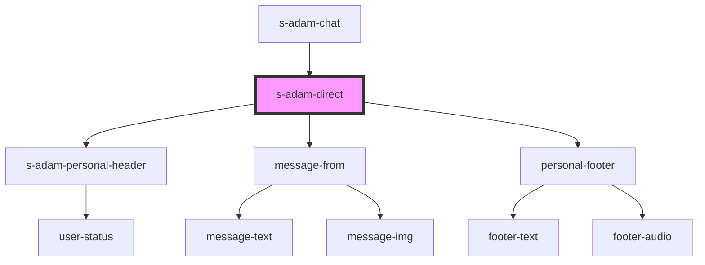

# s-adam-direct

<!-- Auto Generated Below -->

## Properties

| Property  | Attribute | Description   | Type            | Default |
| --------- | --------- | ------------- | --------------- | ------- |
| `message` | --        | Личный диалог | `ChatMessage[]` | `[]`    |

## Events

| Event                   | Description                            | Type                  |
| ----------------------- | -------------------------------------- | --------------------- |
| `searchPersonalMessage` | Клик по иконке поиска                  | `CustomEvent<string>` |
| `visibleUserProfile`    | клик по имени юзера в личной переписке | `CustomEvent<void>`   |

## Dependencies

### Used by

 - [s-adam-chat](../s-adam-chat)

### Depends on

- [s-adam-personal-header](../s-adam-personal-header)
- [message-from](../../shared/messages/message-from)
- [personal-footer](../../shared/personal-footer)

### Graph

----------------------------------------------

*Built with [StencilJS](https://stenciljs.com/)*
