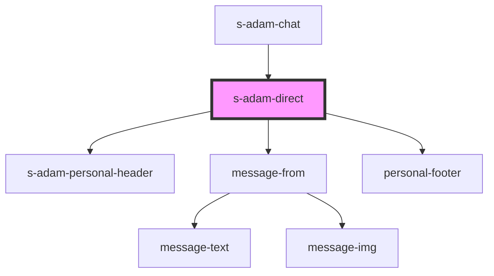

# s-adam-direct

<!-- Auto Generated Below -->

## Properties

| Property  | Attribute | Description   | Type        | Default |
| --------- | --------- | ------------- | ----------- | ------- |
| `message` | --        | Личный диалог | `Message[]` | `[]`    |

## Events

| Event                  | Description                            | Type               |
| ---------------------- | -------------------------------------- | ------------------ |
| `clickOnSearchMessage` | Клик по иконке поиска                  | `CustomEvent<any>` |
| `clickOnUsername`      | клик по имени юзера в личной переписке | `CustomEvent<any>` |
| `clickToLink`          | click on navigate                      | `CustomEvent<any>` |

## Dependencies

### Used by

 - [s-adam-chat](../s-adam-chat)

### Depends on

- [s-adam-personal-header](../s-adam-personal-header)
- [message-from](../../shared/messages/message-from)
- [personal-footer](../../shared/personal-footer)

### Graph

----------------------------------------------

*Built with [StencilJS](https://stenciljs.com/)*
