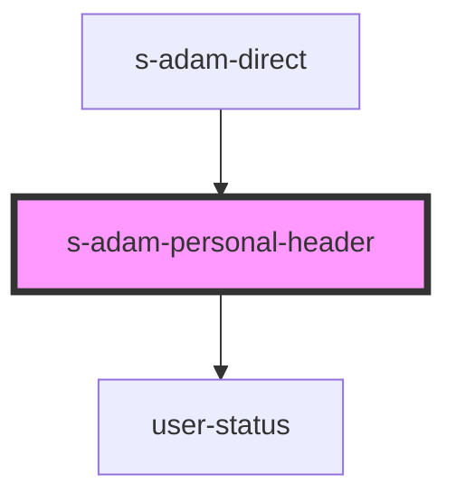

# s-adam-personal-header

<!-- Auto Generated Below -->

## Properties

| Property            | Attribute             | Description   | Type                                                            | Default     |
| ------------------- | --------------------- | ------------- | --------------------------------------------------------------- | ----------- |
| `chatPresenceState` | `chat-presence-state` |               | `ChatUserPresenceState.offline \| ChatUserPresenceState.online` | `undefined` |
| `message`           | --                    | Личный диалог | `ChatMessage[]`                                                 | `[]`        |

## Events

| Event                   | Description                            | Type                  |
| ----------------------- | -------------------------------------- | --------------------- |
| `resetMessagesFilter`   | Сброс фильтра сообщений                | `CustomEvent<void>`   |
| `searchPersonalMessage` | Клик по иконке поиска                  | `CustomEvent<string>` |
| `visibleUserProfile`    | клик по имени юзера в личной переписке | `CustomEvent<void>`   |

## Dependencies

### Used by

 - [s-adam-direct](../s-adam-direct)

### Depends on

- [user-status](../../shared/user-status)

### Graph

----------------------------------------------

*Built with [StencilJS](https://stenciljs.com/)*
