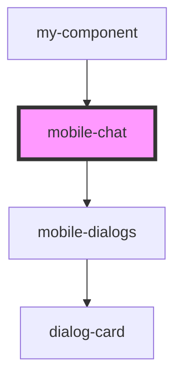

# mobile-chat

<!-- Auto Generated Below -->

## Dependencies

### Used by

 - [my-component](../../my-component)

### Depends on

- [mobile-dialogs](./res/view/mobile-dialogs)

### Graph

----------------------------------------------

*Built with [StencilJS](https://stenciljs.com/)*
