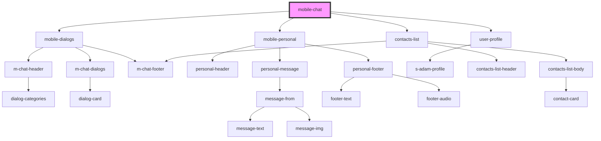

# mobile-chat

<!-- Auto Generated Below -->

## Dependencies

### Depends on

- [mobile-dialogs](./res/view/mobile-dialogs)
- [mobile-personal](./res/view/mobile-personal)
- [user-profile](./res/view/user-profile)
- [contacts-list](./res/view/contacts-list)

### Graph

----------------------------------------------

*Built with [StencilJS](https://stenciljs.com/)*
