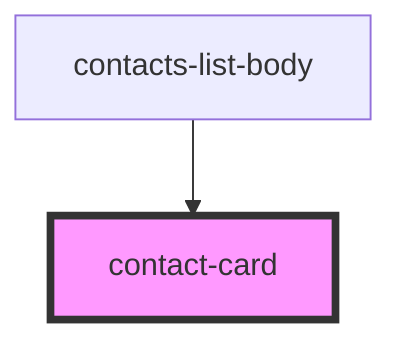

# contact-card

<!-- Auto Generated Below -->

## Properties

| Property  | Attribute | Description       | Type  | Default     |
| --------- | --------- | ----------------- | ----- | ----------- |
| `contact` | `contact` | Принимаем контакт | `any` | `undefined` |

## Events

| Event         | Description       | Type                                |
| ------------- | ----------------- | ----------------------------------- |
| `clickToLink` | clock on navigate | `CustomEvent<ChatContactInterface>` |

## Dependencies

### Used by

 - [contacts-list-body](../contacts-list-body)

### Graph

----------------------------------------------

*Built with [StencilJS](https://stenciljs.com/)*
