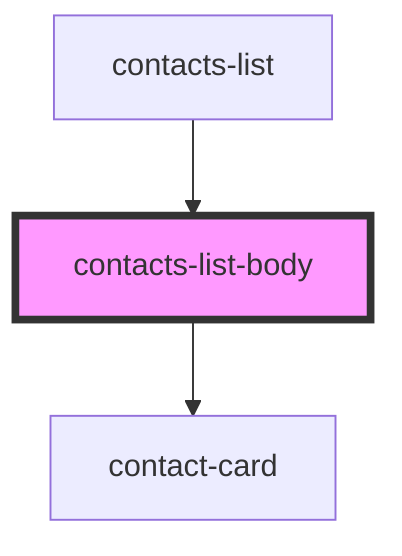

# contacts-list-body

<!-- Auto Generated Below -->

## Properties

| Property   | Attribute | Description | Type                     | Default     |
| ---------- | --------- | ----------- | ------------------------ | ----------- |
| `contacts` | --        |             | `ChatContactInterface[]` | `undefined` |

## Dependencies

### Used by

 - [contacts-list](../../..)

### Depends on

- [contact-card](../contact-card)

### Graph

----------------------------------------------

*Built with [StencilJS](https://stenciljs.com/)*
