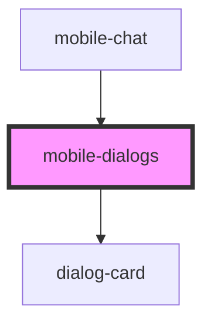

# mobile-dialogs

<!-- Auto Generated Below -->

## Properties

| Property     | Attribute | Description               | Type           | Default     |
| ------------ | --------- | ------------------------- | -------------- | ----------- |
| `categories` | --        | массив категорий диалогов | `categories[]` | `undefined` |
| `dialogs`    | --        | массив сообщений          | `dialogs[]`    | `undefined` |

## Events

| Event             | Description          | Type               |
| ----------------- | -------------------- | ------------------ |
| `clickToCategory` | clock on Category    | `CustomEvent<any>` |
| `clickToLink`     | clock on clickToLink | `CustomEvent<any>` |

## Dependencies

### Used by

 - [mobile-chat](../../..)

### Depends on

- [dialog-card](../../../../../shared/dialog-card)

### Graph

----------------------------------------------

*Built with [StencilJS](https://stenciljs.com/)*
