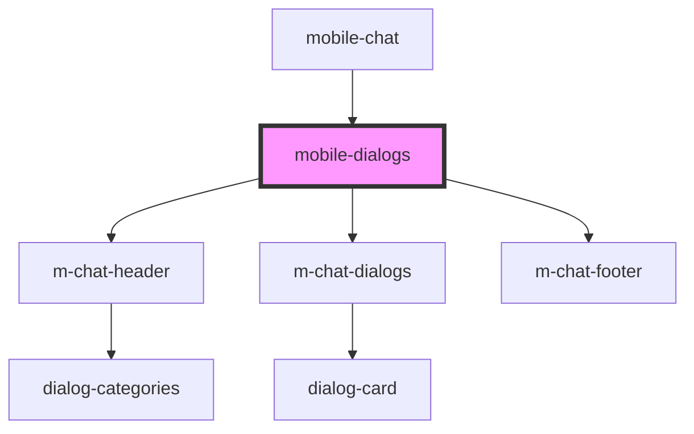

# mobile-dialogs

<!-- Auto Generated Below -->

## Properties

| Property     | Attribute | Description               | Type                      | Default     |
| ------------ | --------- | ------------------------- | ------------------------- | ----------- |
| `categories` | --        | массив категорий диалогов | `ChatCategoryInterface[]` | `undefined` |
| `dialogs`    | --        | массив сообщений          | `ChatDialogInterface[]`   | `undefined` |

## Events

| Event             | Description          | Type                                 |
| ----------------- | -------------------- | ------------------------------------ |
| `clickToCategory` | clock on Category    | `CustomEvent<ChatCategoryInterface>` |
| `clickToLink`     | clock on clickToLink | `CustomEvent<string>`                |
| `searchContact`   | clock on Category    | `CustomEvent<ChatCategoryInterface>` |

## Dependencies

### Used by

 - [mobile-chat](../../..)

### Depends on

- [m-chat-header](./res/view/m-chat-header)
- [m-chat-dialogs](./res/view/m-chat-dialogs)
- [m-chat-footer](./res/view/m-chat-footer)

### Graph

----------------------------------------------

*Built with [StencilJS](https://stenciljs.com/)*
