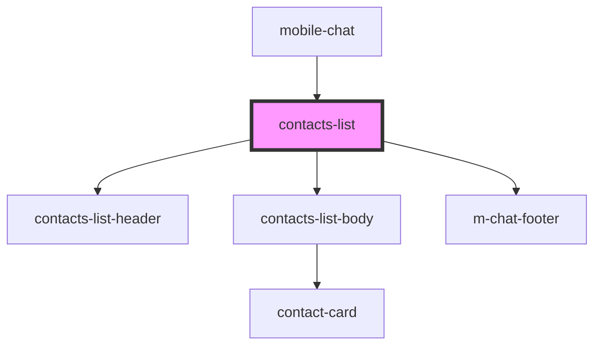

# contacts-list

<!-- Auto Generated Below -->

## Properties

| Property   | Attribute  | Description | Type  | Default     |
| ---------- | ---------- | ----------- | ----- | ----------- |
| `contacts` | `contacts` |             | `any` | `undefined` |

## Events

| Event           | Description          | Type               |
| --------------- | -------------------- | ------------------ |
| `clickToLink`   | clock on clickToLink | `CustomEvent<any>` |
| `searchContact` | search contact       | `CustomEvent<any>` |

## Dependencies

### Used by

 - [mobile-chat](../../../../../..)

### Depends on

- [contacts-list-header](./res/view/contacts-list-header)
- [contacts-list-body](./res/view/contacts-list-body)
- [m-chat-footer](../m-chat-footer)

### Graph

----------------------------------------------

*Built with [StencilJS](https://stenciljs.com/)*
