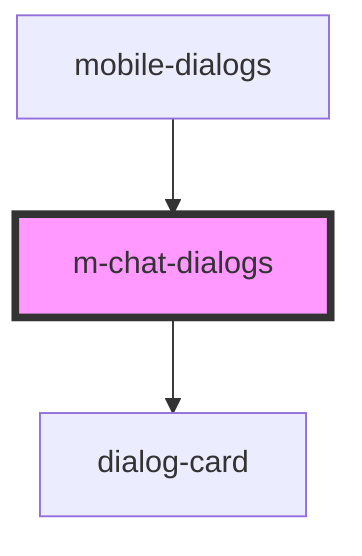

# m-chat-dialogs

<!-- Auto Generated Below -->

## Properties

| Property  | Attribute | Description | Type  | Default     |
| --------- | --------- | ----------- | ----- | ----------- |
| `dialogs` | `dialogs` |             | `any` | `undefined` |

## Events

| Event         | Description | Type               |
| ------------- | ----------- | ------------------ |
| `clickToLink` |             | `CustomEvent<any>` |

## Dependencies

### Used by

 - [mobile-dialogs](../../..)

### Depends on

- [dialog-card](../../../../../../../../shared/dialog-card)

### Graph

----------------------------------------------

*Built with [StencilJS](https://stenciljs.com/)*
