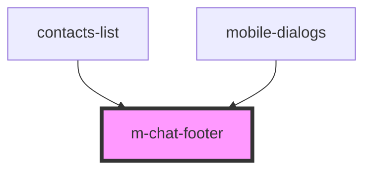

# m-chat-footer

<!-- Auto Generated Below -->

## Properties

| Property | Attribute | Description                                       | Type                   | Default    |
| -------- | --------- | ------------------------------------------------- | ---------------------- | ---------- |
| `theme`  | `theme`   | Данные выбора темы для Мобильная/Модульной версии | `"mobile" \| "module"` | `"mobile"` |

## Events

| Event                 | Description                     | Type                |
| --------------------- | ------------------------------- | ------------------- |
| `clickToShowContacts` | click to click To Show Contacts | `CustomEvent<void>` |
| `clickToShowDialogs`  | click to click To Show Dialogs  | `CustomEvent<void>` |
| `clickToShowMenuBar`  | click to click To Show Contacts | `CustomEvent<void>` |

## Dependencies

### Used by

 - [contacts-list](../../../../../../../../shared/contacts-list)
 - [mobile-dialogs](../../..)

### Graph

----------------------------------------------

*Built with [StencilJS](https://stenciljs.com/)*
