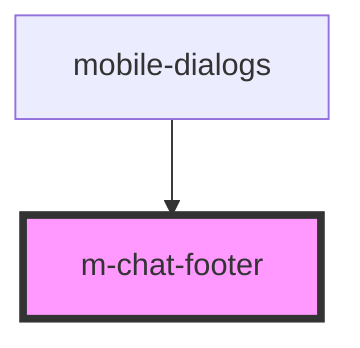

# m-chat-footer

<!-- Auto Generated Below -->

## Events

| Event         | Description          | Type               |
| ------------- | -------------------- | ------------------ |
| `clickToLink` | clock on clickToLink | `CustomEvent<any>` |

## Dependencies

### Used by

 - [mobile-dialogs](../../..)

### Graph

----------------------------------------------

*Built with [StencilJS](https://stenciljs.com/)*
