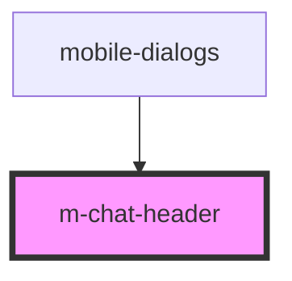

# m-chat-header

<!-- Auto Generated Below -->

## Properties

| Property     | Attribute    | Description               | Type  | Default     |
| ------------ | ------------ | ------------------------- | ----- | ----------- |
| `categories` | `categories` | массив категорий диалогов | `any` | `undefined` |

## Events

| Event             | Description          | Type               |
| ----------------- | -------------------- | ------------------ |
| `clickToCategory` | clock on Category    | `CustomEvent<any>` |
| `clickToLink`     | clock on clickToLink | `CustomEvent<any>` |

## Dependencies

### Used by

 - [mobile-dialogs](../../..)

### Graph

----------------------------------------------

*Built with [StencilJS](https://stenciljs.com/)*
