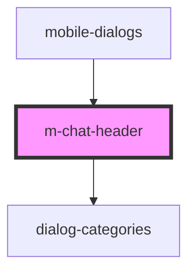

# m-chat-header

<!-- Auto Generated Below -->

## Properties

| Property     | Attribute | Description               | Type                      | Default     |
| ------------ | --------- | ------------------------- | ------------------------- | ----------- |
| `categories` | --        | массив категорий диалогов | `ChatCategoryInterface[]` | `undefined` |

## Events

| Event              | Description            | Type                               |
| ------------------ | ---------------------- | ---------------------------------- |
| `clickToAddDialog` | click to add dialog    | `CustomEvent<void>`                |
| `searchDialogs`    | clock on searchDialogs | `CustomEvent<ChatDialogInterface>` |

## Dependencies

### Used by

 - [mobile-dialogs](../../..)

### Depends on

- [dialog-categories](../../../../../../../../shared/dialog-categories)

### Graph

----------------------------------------------

*Built with [StencilJS](https://stenciljs.com/)*
