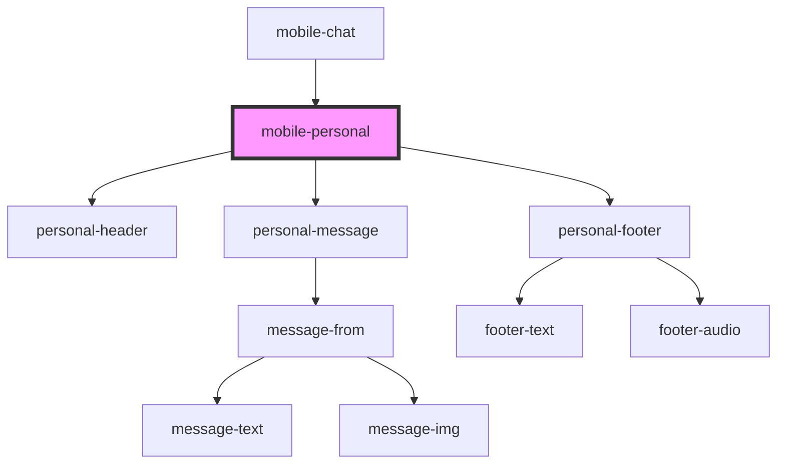

# mobile-personal

<!-- Auto Generated Below -->

## Properties

| Property  | Attribute | Description                  | Type            | Default     |
| --------- | --------- | ---------------------------- | --------------- | ----------- |
| `message` | --        | array data personal messages | `ChatMessage[]` | `undefined` |

## Events

| Event                    | Description                 | Type                  |
| ------------------------ | --------------------------- | --------------------- |
| `clickToShowDialogs`     | click to show Dialogs       | `CustomEvent<string>` |
| `clickToUserProfile`     | click to user profile       | `CustomEvent<string>` |
| `searchPersonalMessages` | search for private messages | `CustomEvent<string>` |

## Dependencies

### Used by

 - [mobile-chat](../../..)

### Depends on

- [personal-header](./res/view/personal-header)
- [personal-message](./res/view/personal-message)
- [personal-footer](../../../../../shared/personal-footer)

### Graph

----------------------------------------------

*Built with [StencilJS](https://stenciljs.com/)*
