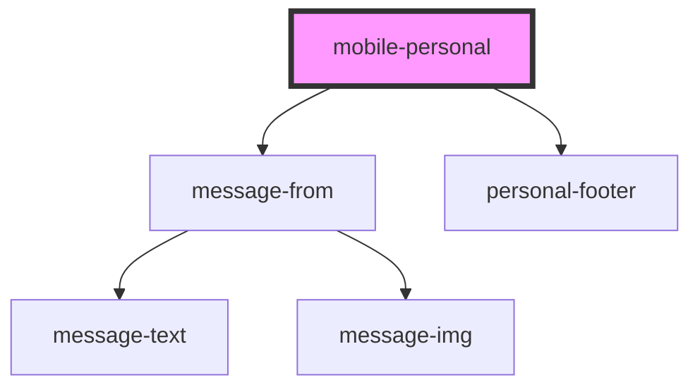

# mobile-personal

<!-- Auto Generated Below -->

## Properties

| Property      | Attribute | Description                  | Type        | Default     |
| ------------- | --------- | ---------------------------- | ----------- | ----------- |
| `messageMock` | --        | array data personal messages | `MessageFrom[]` | `undefined` |

## Events

| Event         | Description       | Type               |
| ------------- | ----------------- | ------------------ |
| `clickToLink` | clock on navigate | `CustomEvent<any>` |

## Dependencies

### Depends on

- [message-from](../../../../../shared/messages/message-from)
- [personal-footer](../../../../../shared/personal-footer)

### Graph

----------------------------------------------

*Built with [StencilJS](https://stenciljs.com/)*
