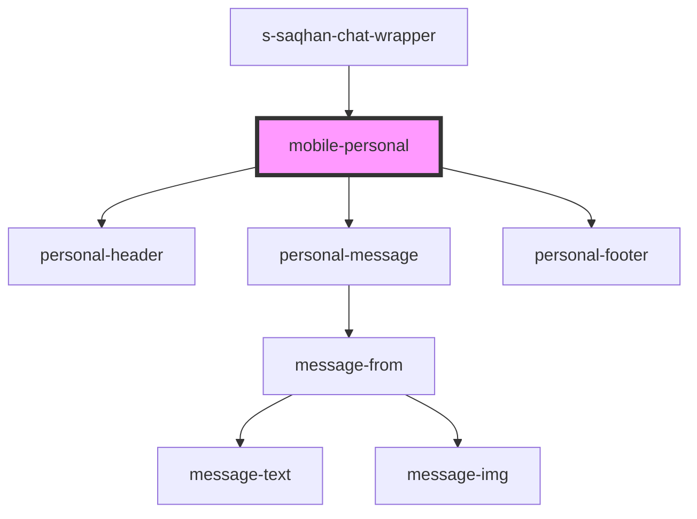

# mobile-personal

<!-- Auto Generated Below -->

## Properties

| Property      | Attribute | Description                  | Type        | Default     |
| ------------- | --------- | ---------------------------- | ----------- | ----------- |
| `messageMock` | --        | array data personal messages | `Message[]` | `undefined` |

## Events

| Event         | Description       | Type               |
| ------------- | ----------------- | ------------------ |
| `clickToLink` | clock on navigate | `CustomEvent<any>` |

## Dependencies

### Used by

 - [s-saqhan-chat-wrapper](../../../../../module/module-chat/res/view/s-saqhan-chat-app/res/view/s-saqhan-chat-wrapper)

### Depends on

- [personal-header](./res/view/personal-header)
- [personal-message](./res/view/personal-message)
- [personal-footer](../../../../../shared/personal-footer)

### Graph

----------------------------------------------

*Built with [StencilJS](https://stenciljs.com/)*
