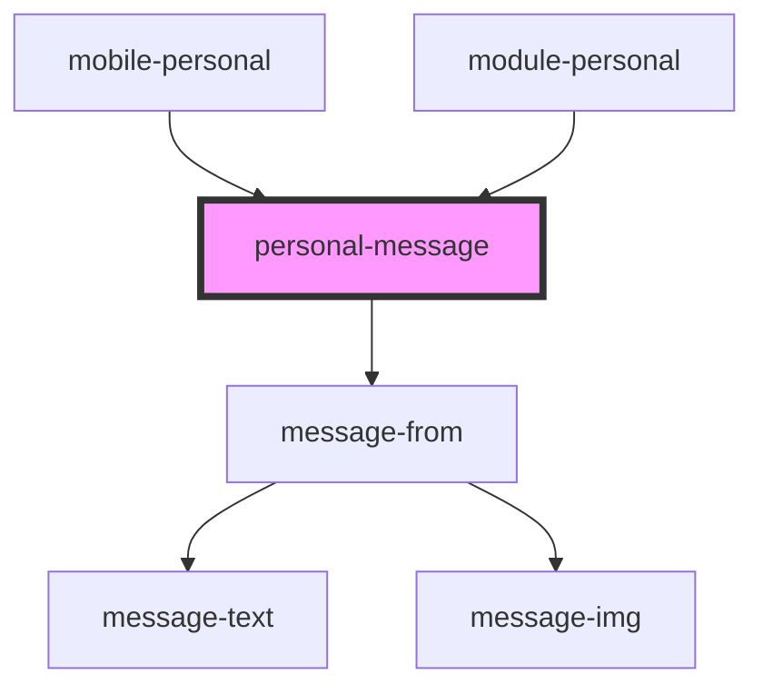

# personal-message

<!-- Auto Generated Below -->

## Properties

| Property  | Attribute | Description                  | Type                             | Default     |
| --------- | --------- | ---------------------------- | -------------------------------- | ----------- |
| `message` | --        | array data personal messages | `ChatMessage[]`                  | `undefined` |
| `theme`   | `theme`   |                              | `"comp" \| "mobile" \| "module"` | `"mobile"`  |
| `writing` | --        |                              | `ChatWritingUserInterface[]`     | `[]`        |

## Dependencies

### Used by

 - [mobile-personal](../../..)
 - [module-personal](../../../../../../../../module/module-chat/res/view/cnt-module-chat/res/view/module-personal)

### Depends on

- [message-from](../../../../../../../../shared/messages/message-from)

### Graph

----------------------------------------------

*Built with [StencilJS](https://stenciljs.com/)*
