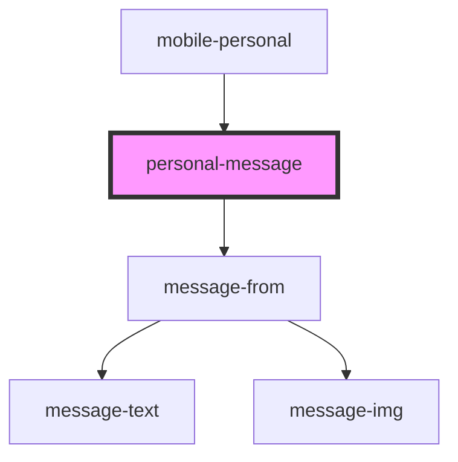

# personal-message

<!-- Auto Generated Below -->

## Properties

| Property      | Attribute      | Description                  | Type  | Default     |
| ------------- | -------------- | ---------------------------- | ----- | ----------- |
| `messageMock` | `message-mock` | array data personal messages | `any` | `undefined` |

## Dependencies

### Used by

 - [mobile-personal](../../..)

### Depends on

- [message-from](../../../../../../../../shared/messages/message-from)

### Graph

----------------------------------------------

*Built with [StencilJS](https://stenciljs.com/)*
