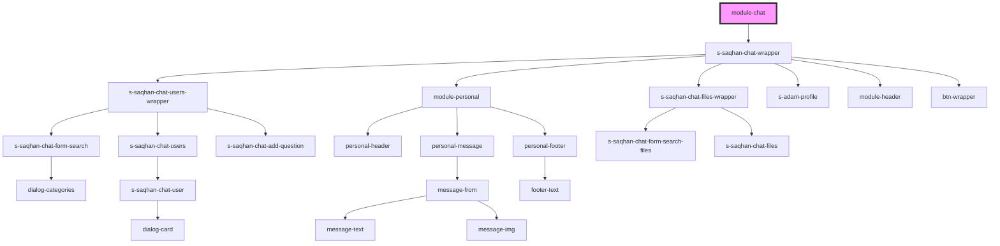

# module-chat

<!-- Auto Generated Below -->

## Dependencies

### Depends on

- [s-saqhan-chat-wrapper](./res/view/s-saqhan-chat-wrapper)

### Graph

----------------------------------------------

*Built with [StencilJS](https://stenciljs.com/)*
