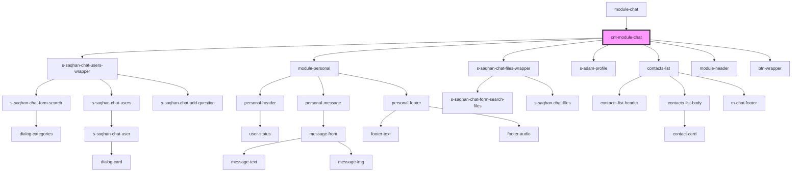

# s-saqhan-chat-wrapper

<!-- Auto Generated Below -->

## Properties

| Property                          | Attribute                             | Description                                                       | Type                                                                                                                                                                             | Default                      |
| --------------------------------- | ------------------------------------- | ----------------------------------------------------------------- | -------------------------------------------------------------------------------------------------------------------------------------------------------------------------------- | ---------------------------- |
| `canRecordAudio`                  | `can-record-audio`                    | Возможность записи аудио                                          | `boolean`                                                                                                                                                                        | `false`                      |
| `categories`                      | --                                    | array categories                                                  | `ChatCategoryInterface[]`                                                                                                                                                        | `undefined`                  |
| `chatViewState`                   | `chat-view-state`                     | select content default                                            | `ChatViewToShowEnum.contacts \| ChatViewToShowEnum.dialogs \| ChatViewToShowEnum.files \| ChatViewToShowEnum.personal \| ChatViewToShowEnum.profile \| ChatViewToShowEnum.users` | `ChatViewToShowEnum.dialogs` |
| `contacts`                        | `contacts`                            | масиив данных контактов                                           | `any`                                                                                                                                                                            | `undefined`                  |
| `dialogs`                         | --                                    | массив данных для диалогов                                        | `ChatDialogInterface[]`                                                                                                                                                          | `undefined`                  |
| `disableInnerSearchDialogsState`  | `disable-inner-search-dialogs-state`  | отключение поиска диалогов                                        | `boolean`                                                                                                                                                                        | `undefined`                  |
| `disableInnerSearchMessagesState` | `disable-inner-search-messages-state` | отключение поиска сообщений                                       | `boolean`                                                                                                                                                                        | `undefined`                  |
| `message`                         | --                                    | массив данных личных сообщений                                    | `ChatMessage[]`                                                                                                                                                                  | `undefined`                  |
| `openState`                       | `open-state`                          | Перменная для включения/отключения показа чата в развернутом виде | `boolean`                                                                                                                                                                        | `undefined`                  |
| `titleModule`                     | --                                    | Заголовок для чата                                                | `TitleModuleInterface`                                                                                                                                                           | `undefined`                  |
| `visibleState`                    | `visible-state`                       | видимость                                                         | `boolean`                                                                                                                                                                        | `true`                       |
| `writing`                         | --                                    | добавляем печатающий                                              | `ChatWritingUserInterface[]`                                                                                                                                                     | `[]`                         |

## Events

| Event                 | Description           | Type                                                                                                                                                                                          |
| --------------------- | --------------------- | --------------------------------------------------------------------------------------------------------------------------------------------------------------------------------------------- |
| `chatViewStateChange` |                       | `CustomEvent<ChatViewToShowEnum.contacts \| ChatViewToShowEnum.dialogs \| ChatViewToShowEnum.files \| ChatViewToShowEnum.personal \| ChatViewToShowEnum.profile \| ChatViewToShowEnum.users>` |
| `clickToDialog`       | click to dialog       | `CustomEvent<ChatDialogInterface>`                                                                                                                                                            |
| `clickToFilesBtn`     | click to files button | `CustomEvent<void>`                                                                                                                                                                           |
| `sendTextMessage`     |                       | `CustomEvent<string>`                                                                                                                                                                         |

## Methods

### `activeRecordAudioState(state: boolean) => Promise<void>`

позволяет активировать/деактивароть возможность записи аудио

#### Returns

Type: `Promise<void>`

### `changeViewToShow(state: ChatViewToShowEnum) => Promise<void>`

сменить окно показа

#### Returns

Type: `Promise<void>`

### `close() => Promise<void>`

показывает только кнопку

#### Returns

Type: `Promise<void>`

### `hide() => Promise<void>`

скрывает весь блок что бы на экране не было вообще видно

#### Returns

Type: `Promise<void>`

### `open() => Promise<void>`

открывает блок чатов

#### Returns

Type: `Promise<void>`

### `openDialog(dialog: ChatDialogInterface) => Promise<void>`

#### Returns

Type: `Promise<void>`

### `safeScrollToBotMessageView() => Promise<void>`

скролит вниз окно сообщений

#### Returns

Type: `Promise<void>`

### `setWritingState(item?: ChatWritingUserInterface) => Promise<void>`

позволяет установить печатающие данные

#### Returns

Type: `Promise<void>`

### `show() => Promise<void>`

показывает весь блок после скрытия

#### Returns

Type: `Promise<void>`

## Dependencies

### Used by

 - [module-chat](../../..)

### Depends on

- [s-saqhan-chat-users-wrapper](./res/view/s-saqhan-chat-users-wrapper)
- [module-personal](./res/view/module-personal)
- [s-saqhan-chat-files-wrapper](./sub/view/s-saqhan-chat-files-wrapper)
- [s-adam-profile](../../../../../shared/s-adam-profile)
- [contacts-list](../../../../../shared/contacts-list)
- [module-header](./sub/view/module-header)
- [btn-wrapper](./sub/view/btn-wrapper)

### Graph

----------------------------------------------

*Built with [StencilJS](https://stenciljs.com/)*
