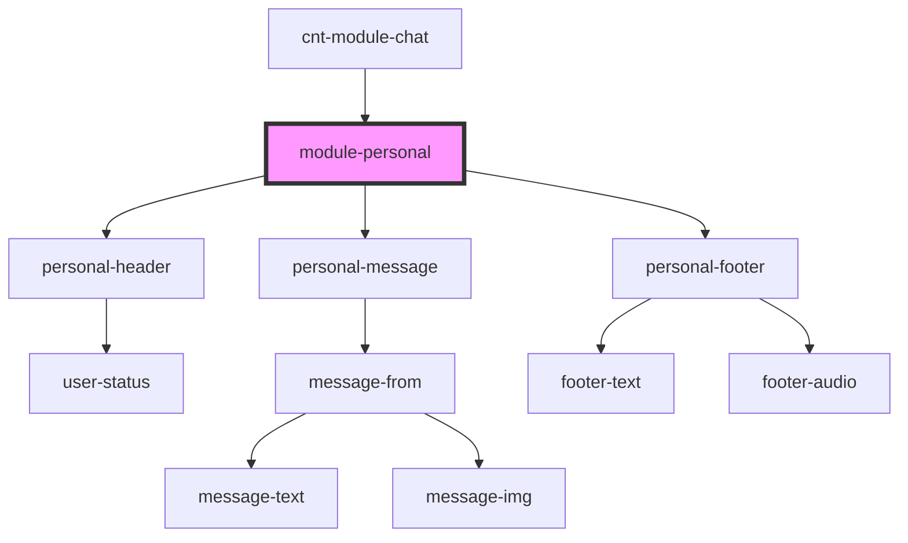

# module-personal

<!-- Auto Generated Below -->

## Properties

| Property         | Attribute          | Description                  | Type                         | Default     |
| ---------------- | ------------------ | ---------------------------- | ---------------------------- | ----------- |
| `canRecordAudio` | `can-record-audio` | Возможность записи аудио     | `boolean`                    | `false`     |
| `dialogs`        | --                 | array data dialogs           | `ChatDialogInterface[]`      | `undefined` |
| `message`        | --                 | array data personal messages | `ChatMessage[]`              | `undefined` |
| `writing`        | --                 |                              | `ChatWritingUserInterface[]` | `[]`        |

## Events

| Event                    | Description                 | Type                  |
| ------------------------ | --------------------------- | --------------------- |
| `cancelSearchPersonal`   |                             | `CustomEvent<void>`   |
| `clickToShowDialogs`     | show dialogs                | `CustomEvent<void>`   |
| `clickToUserProfile`     | on click to profile user    | `CustomEvent<void>`   |
| `searchPersonalMessages` | search for private messages | `CustomEvent<string>` |
| `sendTextMessage`        |                             | `CustomEvent<string>` |

## Dependencies

### Used by

 - [cnt-module-chat](../../..)

### Depends on

- [personal-header](../../../../../../../../shared/personal-header)
- [personal-message](../../../../../../../../mobile/mobile-chat/res/view/mobile-personal/res/view/personal-message)
- [personal-footer](../../../../../../../../shared/personal-footer)

### Graph

----------------------------------------------

*Built with [StencilJS](https://stenciljs.com/)*
