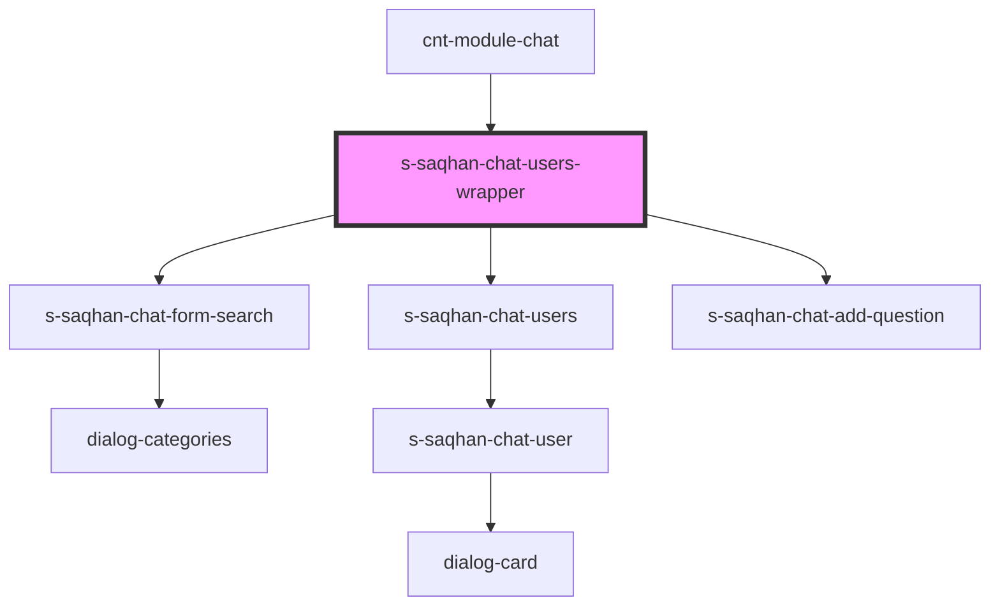

# s-saqhan-chat-users-wrapper

<!-- Auto Generated Below -->

## Properties

| Property          | Attribute | Description                  | Type                      | Default |
| ----------------- | --------- | ---------------------------- | ------------------------- | ------- |
| `categories`      | --        |                              | `ChatCategoryInterface[]` | `[]`    |
| `dialogs`         | --        | Массив данных с диалогами    | `ChatDialogInterface[]`   | `[]`    |
| `personalMessage` | --        | Массив данных с личным чатом | `ChatMessage[]`           | `[]`    |

## Events

| Event              | Description           | Type                                 |
| ------------------ | --------------------- | ------------------------------------ |
| `clickToCategory`  |                       | `CustomEvent<ChatCategoryInterface>` |
| `clickToDialog`    | click to dialog       | `CustomEvent<ChatDialogInterface>`   |
| `clickToFilesBtn`  | click to files button | `CustomEvent<void>`                  |
| `searchDialog`     |                       | `CustomEvent<string>`                |
| `sendNewMessModal` | send new mess         | `CustomEvent<string>`                |

## Dependencies

### Used by

 - [cnt-module-chat](../../..)

### Depends on

- [s-saqhan-chat-form-search](./res/view/s-saqhan-chat-form-search)
- [s-saqhan-chat-users](./res/view/s-saqhan-chat-users)
- [s-saqhan-chat-add-question](../../../sub/view/s-saqhan-chat-add-question)

### Graph

----------------------------------------------

*Built with [StencilJS](https://stenciljs.com/)*
