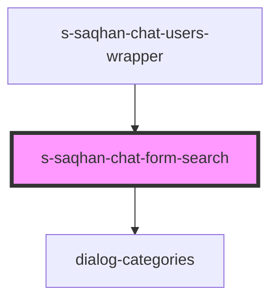

# s-saqhan-chat-form-search

<!-- Auto Generated Below -->

## Properties

| Property     | Attribute | Description      | Type                      | Default |
| ------------ | --------- | ---------------- | ------------------------- | ------- |
| `categories` | --        | array categories | `ChatCategoryInterface[]` | `[]`    |

## Events

| Event             | Description           | Type                  |
| ----------------- | --------------------- | --------------------- |
| `clickToFilesBtn` | Клик по кнопке files  | `CustomEvent<void>`   |
| `searchDialog`    | Клик по кнопке в чате | `CustomEvent<string>` |

## Dependencies

### Used by

 - [s-saqhan-chat-users-wrapper](../../..)

### Depends on

- [dialog-categories](../../../../../../../../../../../shared/dialog-categories)

### Graph

----------------------------------------------

*Built with [StencilJS](https://stenciljs.com/)*
