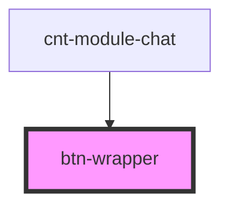

# btn-wrapper

<!-- Auto Generated Below -->

## Properties

| Property   | Attribute   | Description | Type      | Default     |
| ---------- | ----------- | ----------- | --------- | ----------- |
| `dialogs`  | `dialogs`   |             | `number`  | `undefined` |
| `showChat` | `show-chat` |             | `boolean` | `undefined` |

## Events

| Event             | Description          | Type                |
| ----------------- | -------------------- | ------------------- |
| `clickToShowChat` | clock on clickToLink | `CustomEvent<void>` |

## Dependencies

### Used by

 - [cnt-module-chat](../../..)

### Graph

----------------------------------------------

*Built with [StencilJS](https://stenciljs.com/)*
