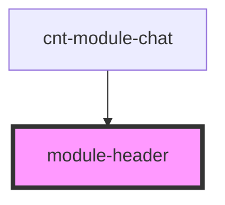

# module-header

<!-- Auto Generated Below -->

## Properties

| Property      | Attribute | Description | Type                   | Default     |
| ------------- | --------- | ----------- | ---------------------- | ----------- |
| `titleModule` | --        |             | `TitleModuleInterface` | `undefined` |

## Events

| Event          | Description                                       | Type                |
| -------------- | ------------------------------------------------- | ------------------- |
| `close`        | close modal                                       | `CustomEvent<void>` |
| `showFullChat` | Разворачивать полную версию чата при клике иконку | `CustomEvent<void>` |

## Dependencies

### Used by

 - [cnt-module-chat](../../..)

### Graph

----------------------------------------------

*Built with [StencilJS](https://stenciljs.com/)*
