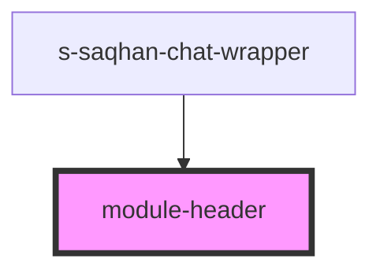

# module-header

<!-- Auto Generated Below -->

## Properties

| Property      | Attribute      | Description | Type  | Default     |
| ------------- | -------------- | ----------- | ----- | ----------- |
| `titleModule` | `title-module` |             | `any` | `undefined` |

## Events

| Event   | Description | Type               |
| ------- | ----------- | ------------------ |
| `close` | close modal | `CustomEvent<any>` |

## Dependencies

### Used by

 - [s-saqhan-chat-wrapper](../s-saqhan-chat-wrapper)

### Graph

----------------------------------------------

*Built with [StencilJS](https://stenciljs.com/)*
