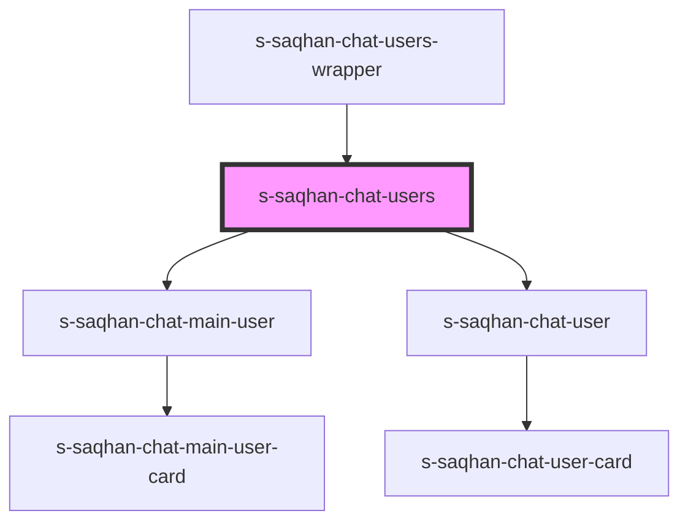

# s-saqhan-chat-users

<!-- Auto Generated Below -->

## Properties

| Property   | Attribute   | Description | Type  | Default     |
| ---------- | ----------- | ----------- | ----- | ----------- |
| `mainUser` | `main-user` |             | `any` | `undefined` |
| `messages` | `messages`  |             | `any` | `undefined` |

## Dependencies

### Used by

 - [s-saqhan-chat-users-wrapper](../../..)

### Depends on

- [s-saqhan-chat-main-user](./res/view/s-saqhan-chat-main-user)
- [s-saqhan-chat-user](./res/view/s-saqhan-chat-user)

### Graph

----------------------------------------------

*Built with [StencilJS](https://stenciljs.com/)*
