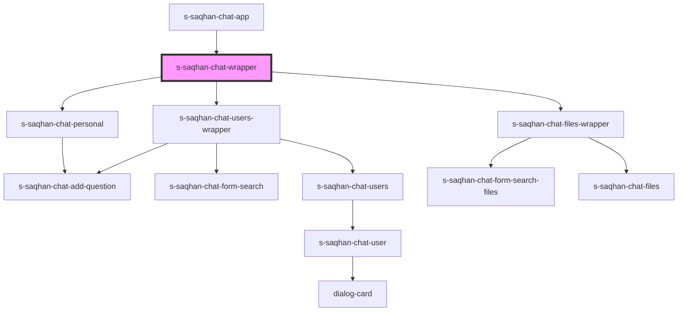

# s-saqhan-chat-wrapper

<!-- Auto Generated Below -->

## Properties

| Property      | Attribute      | Description | Type     | Default     |
| ------------- | -------------- | ----------- | -------- | ----------- |
| `messages`    | `messages`     |             | `any`    | `undefined` |
| `showContent` | `show-content` |             | `string` | `undefined` |

## Events

| Event            | Description | Type               |
| ---------------- | ----------- | ------------------ |
| `clickToLink`    |             | `CustomEvent<any>` |
| `close`          |             | `CustomEvent<any>` |
| `selectFiles`    |             | `CustomEvent<any>` |
| `selectPersonal` |             | `CustomEvent<any>` |
| `selectUsers`    |             | `CustomEvent<any>` |

## Dependencies

### Used by

 - [s-saqhan-chat-app](../../..)

### Depends on

- [s-saqhan-chat-personal](../s-saqhan-chat-personal)
- [s-saqhan-chat-users-wrapper](../s-saqhan-chat-users-wrapper)
- [s-saqhan-chat-files-wrapper](../s-saqhan-chat-files-wrapper)

### Graph

----------------------------------------------

*Built with [StencilJS](https://stenciljs.com/)*
