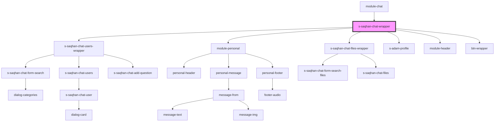

# s-saqhan-chat-wrapper

<!-- Auto Generated Below -->

## Properties

| Property      | Attribute      | Description                    | Type  | Default     |
| ------------- | -------------- | ------------------------------ | ----- | ----------- |
| `MessageMock` | `message-mock` | массив данных личных сообщений | `any` | `undefined` |
| `categories`  | `categories`   | array categories               | `any` | `undefined` |
| `dialogs`     | `dialogs`      | массив данных для диалогов     | `any` | `undefined` |
| `titleModule` | `title-module` | Заголовок для чата             | `any` | `undefined` |

## Methods

### `clickToCategory({ detail }: { detail: any; }) => Promise<void>`

Фильтр диалогов

#### Returns

Type: `Promise<void>`

### `searchDialog({ detail }: { detail: any; }) => Promise<void>`

Метод поиски диалогов

#### Returns

Type: `Promise<void>`

### `searchMessage({ detail }: { detail: any; }) => Promise<void>`

Метод поиска по чату

#### Returns

Type: `Promise<void>`

## Dependencies

### Used by

 - [module-chat](../../..)

### Depends on

- [s-saqhan-chat-users-wrapper](./res/view/s-saqhan-chat-users-wrapper)
- [module-personal](./res/view/module-personal)
- [s-saqhan-chat-files-wrapper](../s-saqhan-chat-files-wrapper)
- [s-adam-profile](../../../../../shared/s-adam-profile)
- [module-header](../module-header)
- [btn-wrapper](../btn-wrapper)

### Graph

----------------------------------------------

*Built with [StencilJS](https://stenciljs.com/)*
