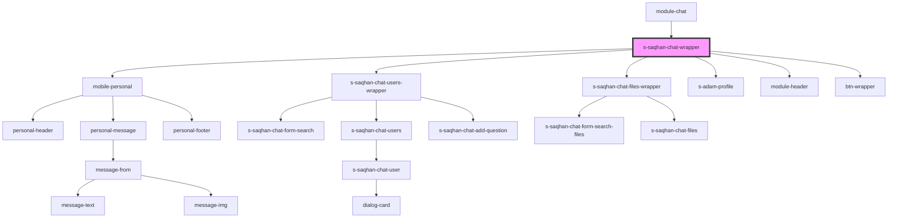

# s-saqhan-chat-wrapper

<!-- Auto Generated Below -->

## Events

| Event            | Description | Type               |
| ---------------- | ----------- | ------------------ |
| `selectPersonal` |             | `CustomEvent<any>` |
| `selectUsers`    |             | `CustomEvent<any>` |

## Dependencies

### Used by

 - [module-chat](../../..)

### Depends on

- [mobile-personal](../../../../../mobile/mobile-chat/res/view/mobile-personal)
- [s-saqhan-chat-users-wrapper](./res/view/s-saqhan-chat-users-wrapper)
- [s-saqhan-chat-files-wrapper](../s-saqhan-chat-app/res/view/s-saqhan-chat-files-wrapper)
- [s-adam-profile](../../../../../shared/s-adam-profile)
- [module-header](../module-header)
- [btn-wrapper](../btn-wrapper)

### Graph

----------------------------------------------

*Built with [StencilJS](https://stenciljs.com/)*
