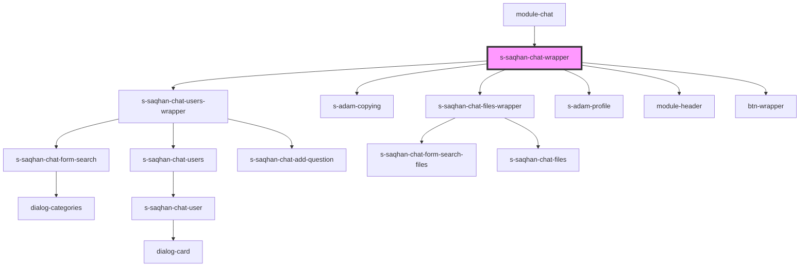

# s-saqhan-chat-wrapper

<!-- Auto Generated Below -->

## Properties

| Property      | Attribute      | Description                | Type  | Default     |
| ------------- | -------------- | -------------------------- | ----- | ----------- |
| `MessageMock` | `message-mock` |                            | `any` | `undefined` |
| `categories`  | `categories`   | array categories           | `any` | `undefined` |
| `dialogs`     | `dialogs`      | массив данных для диалогов | `any` | `undefined` |
| `titleModule` | `title-module` |                            | `any` | `undefined` |

## Events

| Event            | Description | Type               |
| ---------------- | ----------- | ------------------ |
| `selectPersonal` |             | `CustomEvent<any>` |
| `selectUsers`    |             | `CustomEvent<any>` |

## Dependencies

### Used by

 - [module-chat](../../..)

### Depends on

- [s-saqhan-chat-users-wrapper](./res/view/s-saqhan-chat-users-wrapper)
- [s-adam-copying](../../../../../shared/s-adam-copying)
- [s-saqhan-chat-files-wrapper](../s-saqhan-chat-app/res/view/s-saqhan-chat-files-wrapper)
- [s-adam-profile](../../../../../shared/s-adam-profile)
- [module-header](../module-header)
- [btn-wrapper](../btn-wrapper)

### Graph

----------------------------------------------

*Built with [StencilJS](https://stenciljs.com/)*
