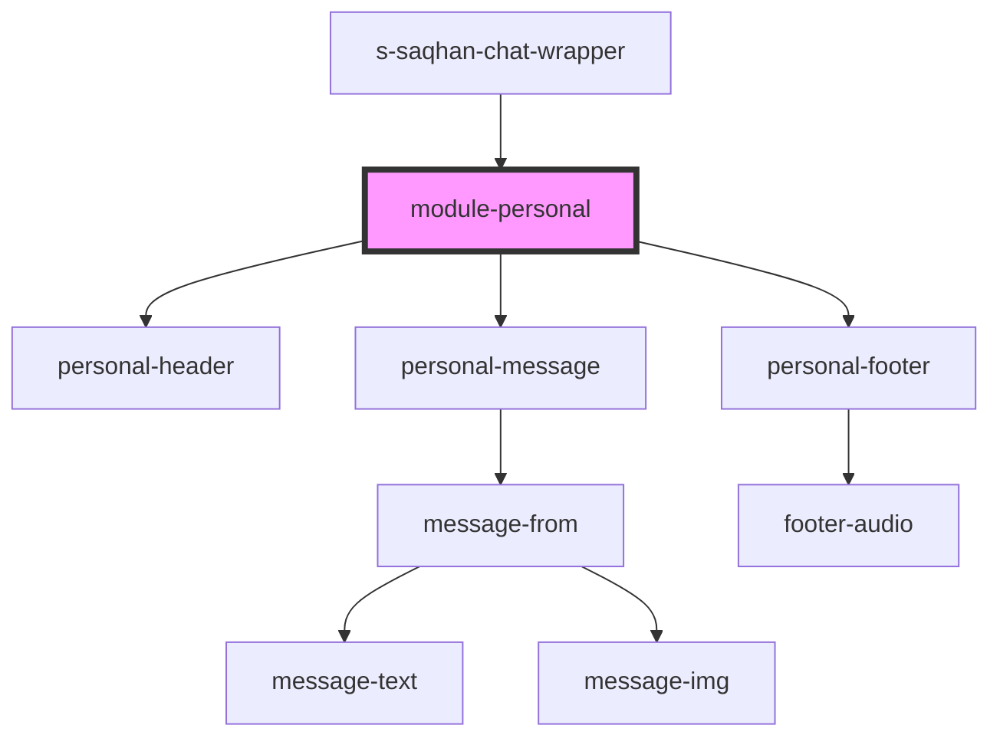

# module-personal

<!-- Auto Generated Below -->

## Properties

| Property      | Attribute | Description                  | Type        | Default     |
| ------------- | --------- | ---------------------------- | ----------- | ----------- |
| `messageMock` | --        | array data personal messages | `Message[]` | `undefined` |

## Events

| Event           | Description       | Type               |
| --------------- | ----------------- | ------------------ |
| `clickToLink`   | clock on navigate | `CustomEvent<any>` |
| `searchContact` |                   | `CustomEvent<any>` |

## Dependencies

### Used by

 - [s-saqhan-chat-wrapper](../../..)

### Depends on

- [personal-header](../../../../../../../../mobile/mobile-chat/res/view/mobile-personal/res/view/personal-header)
- [personal-message](../../../../../../../../mobile/mobile-chat/res/view/mobile-personal/res/view/personal-message)
- [personal-footer](../../../../../../../../shared/personal-footer)

### Graph

----------------------------------------------

*Built with [StencilJS](https://stenciljs.com/)*
