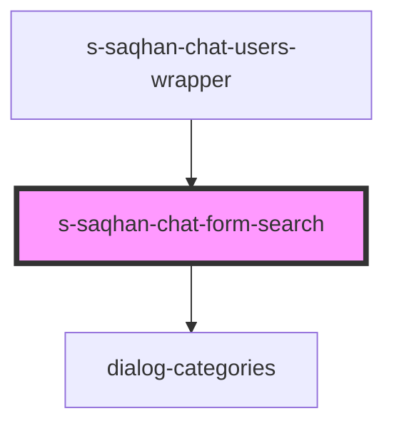

# s-saqhan-chat-form-search

<!-- Auto Generated Below -->

## Properties

| Property     | Attribute    | Description | Type  | Default     |
| ------------ | ------------ | ----------- | ----- | ----------- |
| `categories` | `categories` |             | `any` | `undefined` |

## Events

| Event          | Description           | Type               |
| -------------- | --------------------- | ------------------ |
| `clickToLink`  | Клик по кнопке files  | `CustomEvent<any>` |
| `searchDialog` | Клик по кнопке в чате | `CustomEvent<any>` |

## Dependencies

### Used by

 - [s-saqhan-chat-users-wrapper](../../..)

### Depends on

- [dialog-categories](../../../../../../../../../../../shared/dialog-categories)

### Graph

----------------------------------------------

*Built with [StencilJS](https://stenciljs.com/)*
