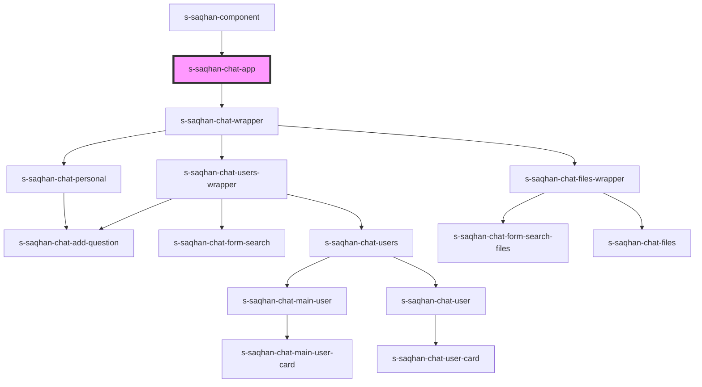

# s-saqhan-chat-app

<!-- Auto Generated Below -->

## Properties

| Property   | Attribute | Description                                      | Type         | Default     |
| ---------- | --------- | ------------------------------------------------ | ------------ | ----------- |
| `mainUser` | --        | Массив данных для главного пользователя (админа) | `mainUser[]` | `undefined` |
| `messages` | --        | Массив данных для обычных пользователей          | `messages[]` | `undefined` |

## Events

| Event               | Description                                             | Type               |
| ------------------- | ------------------------------------------------------- | ------------------ |
| `clickOnSearchChat` | Клик по кнопке в чате                                   | `CustomEvent<any>` |
| `close`             | Переменная для закрытия модального чата                 | `CustomEvent<any>` |
| `selectFiles`       | Открываем файлы чата                                    | `CustomEvent<any>` |
| `selectPersonal`    | Событие при клике на диалог, открываем личные сообщения | `CustomEvent<any>` |
| `selectUsers`       | Открываем диалоги                                       | `CustomEvent<any>` |

## Dependencies

### Used by

 - [s-saqhan-component](../s-saqhan-component)

### Depends on

- [s-saqhan-chat-wrapper](./res/view/s-saqhan-chat-wrapper)

### Graph

----------------------------------------------

*Built with [StencilJS](https://stenciljs.com/)*
