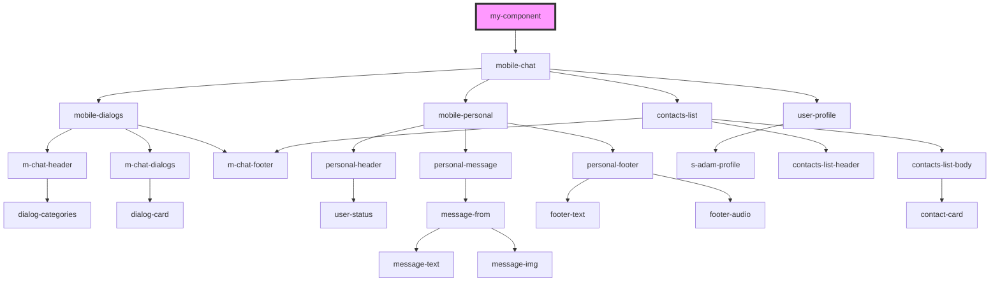

# my-component

<!-- Auto Generated Below -->

## Dependencies

### Depends on

- [mobile-chat](../mobile/mobile-chat)

### Graph

----------------------------------------------

*Built with [StencilJS](https://stenciljs.com/)*
