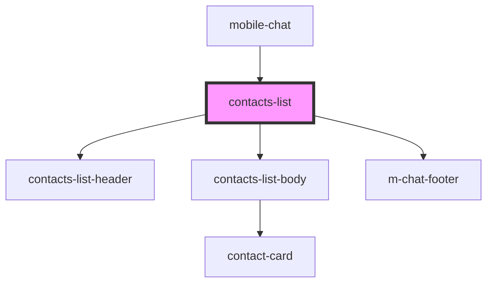

# contacts-list

<!-- Auto Generated Below -->

## Properties

| Property   | Attribute | Description | Type                     | Default     |
| ---------- | --------- | ----------- | ------------------------ | ----------- |
| `contacts` | --        |             | `ChatContactInterface[]` | `undefined` |

## Events

| Event                 | Description                     | Type                                |
| --------------------- | ------------------------------- | ----------------------------------- |
| `clickToContact`      | click to click To Dialog        | `CustomEvent<ChatContactInterface>` |
| `clickToLink`         | clock on clickToLink            | `CustomEvent<string>`               |
| `clickToShowContacts` | click to click To Show Contacts | `CustomEvent<void>`                 |
| `clickToShowDialogs`  | click to click To Show Dialogs  | `CustomEvent<void>`                 |
| `clickToShowMenuBar`  | click to click To Show MenuBar  | `CustomEvent<void>`                 |
| `searchContact`       | search contact                  | `CustomEvent<ChatContactInterface>` |

## Dependencies

### Used by

 - [mobile-chat](../../mobile/mobile-chat)

### Depends on

- [contacts-list-header](res/view/contacts-list-header)
- [contacts-list-body](res/view/contacts-list-body)
- [m-chat-footer](../../mobile/mobile-chat/res/view/mobile-dialogs/res/view/m-chat-footer)

### Graph

----------------------------------------------

*Built with [StencilJS](https://stenciljs.com/)*
