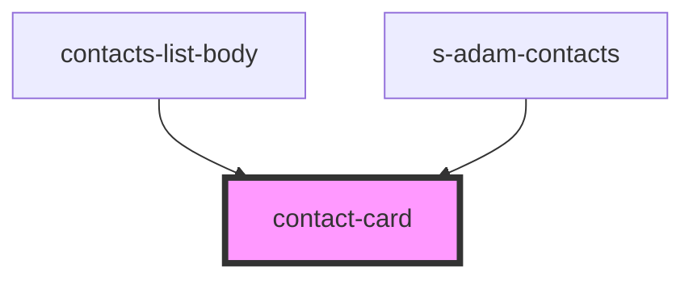

# contact-card

<!-- Auto Generated Below -->

## Properties

| Property  | Attribute | Description                                       | Type                             | Default     |
| --------- | --------- | ------------------------------------------------- | -------------------------------- | ----------- |
| `contact` | --        | Принимаем контакт                                 | `ChatContactInterface`           | `undefined` |
| `theme`   | `theme`   | Данные выбора темы для Мобильная/Модульной версии | `"comp" \| "mobile" \| "module"` | `"mobile"`  |

## Events

| Event            | Description       | Type                                |
| ---------------- | ----------------- | ----------------------------------- |
| `clickToContact` | clock on navigate | `CustomEvent<ChatContactInterface>` |

## Dependencies

### Used by

 - [contacts-list-body](../contacts-list-body)
 - [s-adam-contacts](../../../../../comp/s-adam-contacts)

### Graph

----------------------------------------------

*Built with [StencilJS](https://stenciljs.com/)*
