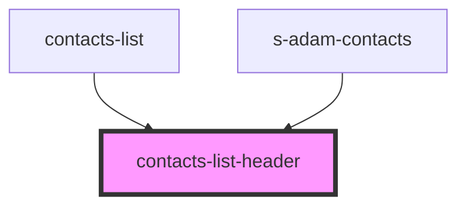

# contacts-list-header

<!-- Auto Generated Below -->

## Properties

| Property | Attribute | Description                                       | Type                             | Default    |
| -------- | --------- | ------------------------------------------------- | -------------------------------- | ---------- |
| `theme`  | `theme`   | Данные выбора темы для Мобильная/Модульной версии | `"comp" \| "mobile" \| "module"` | `"mobile"` |

## Events

| Event                | Description          | Type                  |
| -------------------- | -------------------- | --------------------- |
| `clickToShowDialogs` | clock on clickToLink | `CustomEvent<any>`    |
| `searchContact`      | search contact       | `CustomEvent<string>` |

## Dependencies

### Used by

 - [contacts-list](../../..)
 - [s-adam-contacts](../../../../../comp/s-adam-contacts)

### Graph

----------------------------------------------

*Built with [StencilJS](https://stenciljs.com/)*
