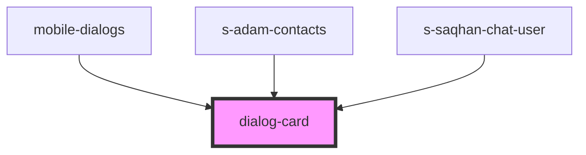

# dialog-card

<!-- Auto Generated Below -->

## Properties

| Property | Attribute | Description      | Type                 | Default     |
| -------- | --------- | ---------------- | -------------------- | ----------- |
| `mess`   | `mess`    | карточка диалога | `any`                | `undefined` |
| `theme`  | `theme`   | карточка диалога | `"comp" \| "mobile"` | `'mobile'`  |

## Events

| Event         | Description       | Type               |
| ------------- | ----------------- | ------------------ |
| `clickToLink` | clock on navigate | `CustomEvent<any>` |

## Dependencies

### Used by

 - [mobile-dialogs](../../mobile/mobile-chat/res/view/mobile-dialogs)
 - [s-adam-contacts](../../comp/s-adam-contacts)
 - [s-saqhan-chat-user](../../module/module-chat/res/view/s-saqhan-chat-app/res/view/s-saqhan-chat-users-wrapper/res/view/s-saqhan-chat-users/res/view/s-saqhan-chat-user)

### Graph

----------------------------------------------

*Built with [StencilJS](https://stenciljs.com/)*
