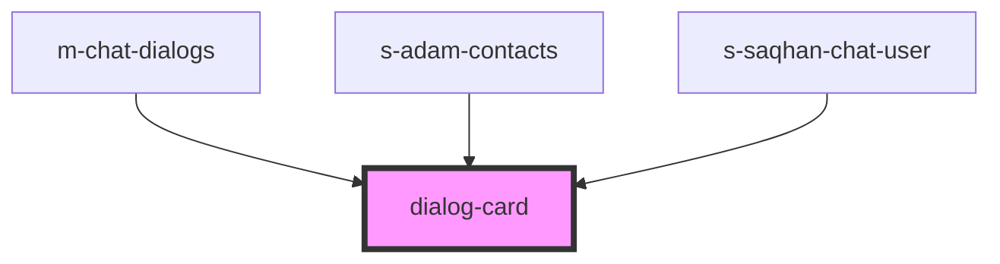

# dialog-card

<!-- Auto Generated Below -->

## Properties

| Property | Attribute | Description      | Type                  | Default     |
| -------- | --------- | ---------------- | --------------------- | ----------- |
| `mess`   | --        | карточка диалога | `ChatDialogInterface` | `undefined` |
| `theme`  | `theme`   | карточка диалога | `"comp" \| "mobile"`  | `"mobile"`  |

## Events

| Event           | Description     | Type                               |
| --------------- | --------------- | ---------------------------------- |
| `clickToDialog` | clock on dialog | `CustomEvent<ChatDialogInterface>` |

## Dependencies

### Used by

 - [m-chat-dialogs](../../mobile/mobile-chat/res/view/mobile-dialogs/res/view/m-chat-dialogs)
 - [s-adam-contacts](../../comp/s-adam-contacts)
 - [s-saqhan-chat-user](../../module/module-chat/res/view/cnt-module-chat/res/view/s-saqhan-chat-users-wrapper/res/view/s-saqhan-chat-users/res/view/s-saqhan-chat-user)

### Graph

----------------------------------------------

*Built with [StencilJS](https://stenciljs.com/)*
