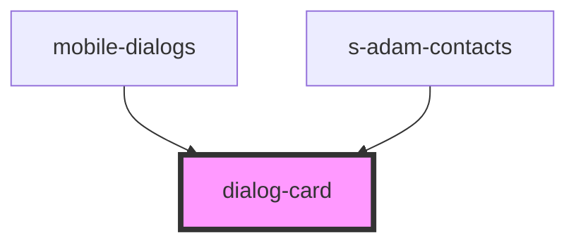

# dialog-card

<!-- Auto Generated Below -->

## Properties

| Property | Attribute | Description      | Type  | Default     |
| -------- | --------- | ---------------- | ----- | ----------- |
| `mess`   | `mess`    | карточка диалога | `any` | `undefined` |

## Events

| Event         | Description       | Type               |
| ------------- | ----------------- | ------------------ |
| `clickToLink` | clock on navigate | `CustomEvent<any>` |

## Dependencies

### Used by

 - [mobile-dialogs](../../mobile/mobile-chat/res/view/mobile-dialogs)
 - [s-adam-contacts](../../comp/s-adam-contacts)

### Graph

----------------------------------------------

*Built with [StencilJS](https://stenciljs.com/)*
